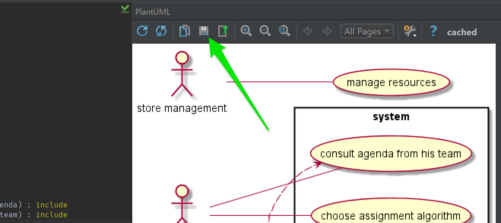

= ODL: Exercices dirigés
François Roland <francois.roland@umons.ac.be>
2017-10-19

Ce repository contient les diagrammes réalisés durant les séances d'exercices dirigés.

== Disclaimer

Il ne s'agit pas de donner ici LA solution aux questions posées mais de partager le résultat de la réflexion menée
en séance. Ce contenu ne peut donc être considéré comme suffisant ou même correct par rapport à l'exercice intégré
qui sera effectué pendant les dernières semaines de labo.

== Outils de documentation

Durant les séances de cours, j'ai utilisé IntelliJ avec le plugin pour PlantUML. Ce plugin permet d'exporter facilement
une image du diagramme.

.Exporter une image à partir du plugin IntelliJ

J'utilise également le plugin AsciiDoc afin d'écrire mes fichiers de documentation (comme ce README.adoc).

== Références

* http://plantuml.com/
* http://asciidoctor.org/
